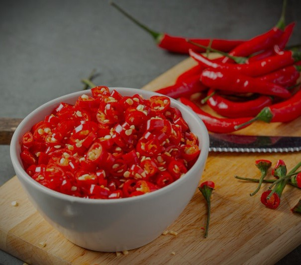
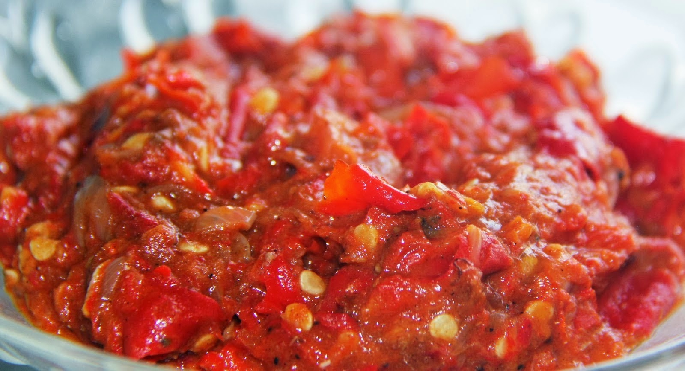
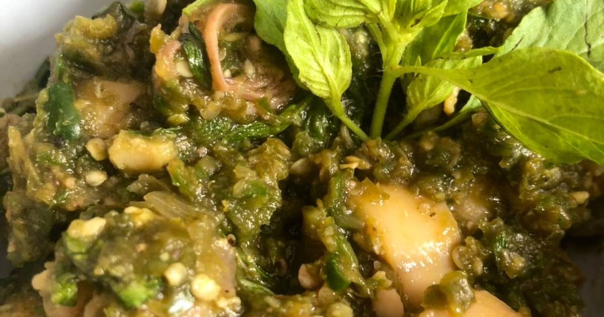
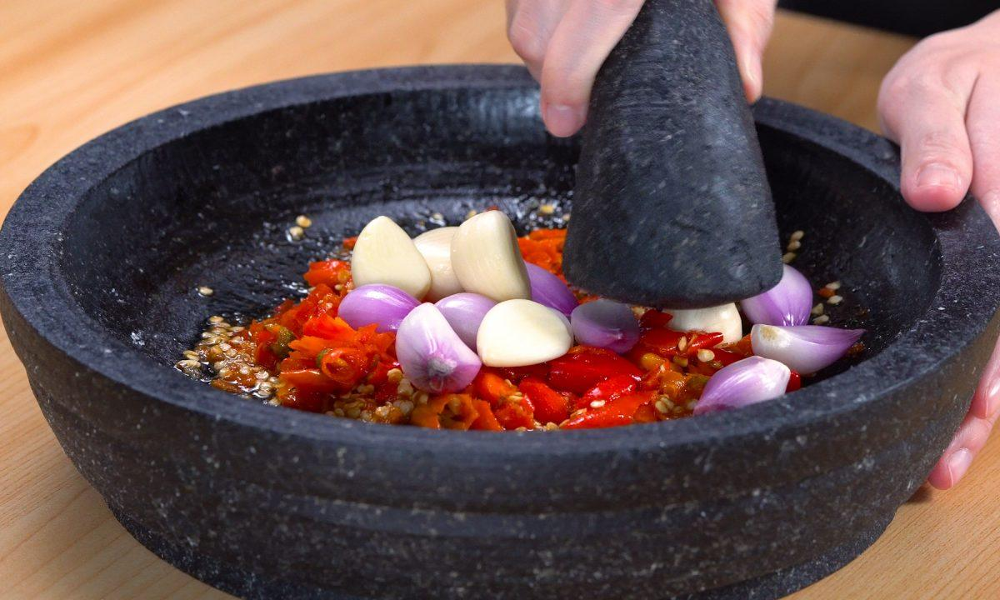
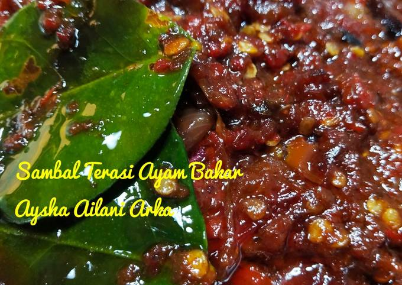
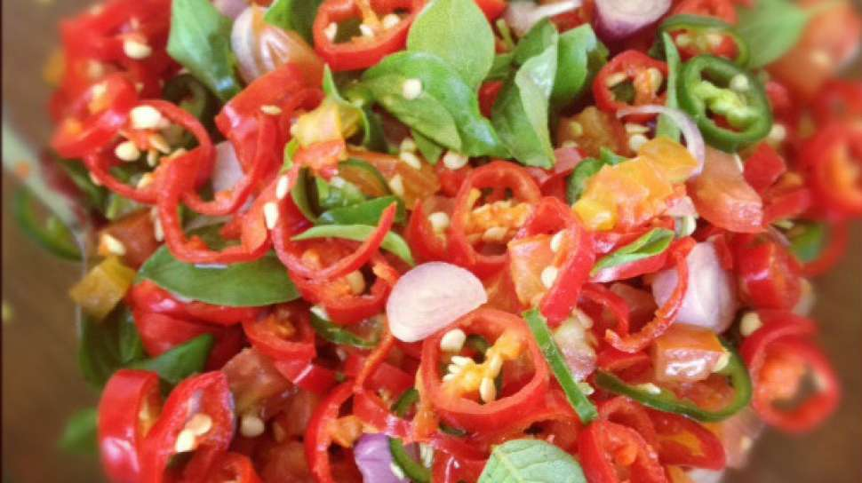
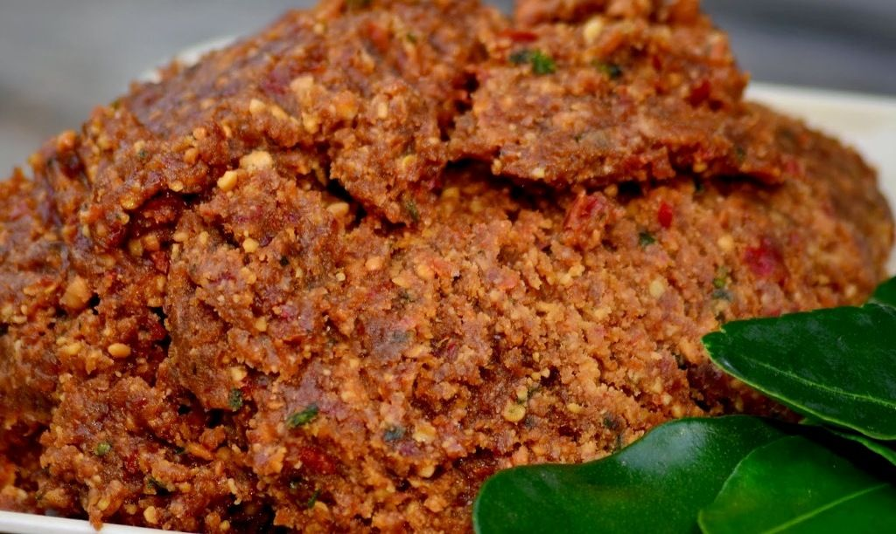

<html lang="id">
<head>
    <meta charset="UTF-8">
    <meta name="viewport" content="width=device-width, initial-scale=1.0">
    <title>Sambal Seuhah - Ledakan Rasa Pedas Autentik</title>
    
    <link href="https://fonts.googleapis.com/css2?family=Poppins:wght@300;400;500;600;700&display=swap" rel="stylesheet">
    <link rel="stylesheet" href="https://cdnjs.cloudflare.com/ajax/libs/font-awesome/6.0.0-beta3/css/all.min.css">
</head>
<body>
    <!-- Header Section -->
    <header>
        

            <h1 class="logo">SAMBAL SEUHAH</h1>
            
Nikmati Ledakan Rasa Pedas Autentik dari Dapur Kami!

        

    </header>
    
    <!-- Navigation -->
    <nav>
        

            <ul>
                <li><a href="#about">Tentang Kami</a></li>
                <li><a href="#menu">Menu Sambal</a></li>
                <li><a href="#why-us">Keunggulan</a></li>
                <li><a href="#promo">Promo</a></li>
                <li><a href="#contact">Kontak</a></li>
            </ul>
        

    </nav>
    
    <!-- About Section -->
    <section id="about" class="section-about">
        

            <h2 class="section-title">Tentang Sambal Seuhah</h2>
            

                

                    
Sambal Seuhah adalah UMKM lokal yang berdedikasi untuk menghadirkan pengalaman kuliner pedas yang autentik dan menggugah selera. Setiap pilihan sambal kami dibuat dengan bahan-bahan segar dan racikan bumbu rahasia yang menjadikan cita rasa pedasnya nendang, gurih, dan bikin ketagihan.

                    
Kami percaya bahwa sambal bukan hanya sekadar pelengkap makanan, tapi juga bisa menjadi bintang utama yang memeriahkan setiap hidangan. Itulah mengapa kami menyajikan berbagai varian sambal dengan karakter rasa yang unik untuk memenuhi selera pecinta pedas dari yang sedang hingga ekstrem.

                

                

                    
                

            

        

    </section>
    
    <!-- Menu Section -->
    <section id="menu" class="section-menu">
        

            <h2 class="section-title">Pilihan Sambal Eksklusif</h2>
            

                <!-- Menu Item 1 -->
                

                    

                        
                    

                    

                        <h3 class="menu-title">Sambal Seuhah Original</h3>
                        
Pedasnya pas, cocok untuk semua kalangan dengan cita rasa yang seimbang antara pedas, gurih, dan sedikit manis.

                        
Rp 25.000/botol

                    

                

                
                <!-- Menu Item 2 -->
                

                    

                        
                    

                    

                        <h3 class="menu-title">Sambal Hijau Kemangi</h3>
                        
Kombinasi segar cabai hijau dan aroma kemangi yang menggoda, memberikan sensasi pedas yang menyegarkan.

                        
Rp 28.000/botol

                    

                

                
                <!-- Menu Item 3 -->
                

                    

                        
                    

                    

                        <h3 class="menu-title">Sambal Bawang Super Pedas</h3>
                        
Untuk pecinta level pedas ekstrem, dijamin bikin keringat mengucur! Dibuat dari cabai rawit pilihan.

                        
Rp 30.000/botol

                    

                

                
                <!-- Menu Item 4 -->
                

                    

                        
                    

                    

                        <h3 class="menu-title">Sambal Terasi Bakar</h3>
                        
Aroma terasi panggang yang harum, pedasnya bikin nagih. Cocok untuk teman makan lalapan dan ikan bakar.

                        
Rp 27.000/botol

                    

                

                
                <!-- Menu Item 5 -->
                

                    

                        
                    

                    

                        <h3 class="menu-title">Sambal Mangga Muda</h3>
                        
Perpaduan pedas dan asam segar, cocok buat teman makan gorengan atau ikan goreng. Rasa unik yang menyegarkan.

                        
Rp 29.000/botol

                    

                

                
                <!-- Menu Item 6 -->
                

                    

                        
                    

                    

                        <h3 class="menu-title">Sambal Dabu-Dabu Manado</h3>
                        
Pedas segar dengan potongan tomat, bawang, dan jeruk limau khas Manado yang menggugah selera.

                        
Rp 32.000/botol

                    

                

                
                <!-- Menu Item 7 -->
                

                    

                        
                    

                    

                        <h3 class="menu-title">Sambal Kacang Pedas</h3>
                        
Rasa gurih kacang dengan sentuhan pedas yang pas, cocok untuk cocolan gorengan atau siraman pecel.

                        
Rp 26.000/botol

                    

                

            

        

    </section>
    
    <!-- Why Us Section -->
    <section id="why-us" class="section-why">
        

            <h2 class="section-title">Kenapa Pilih Sambal Seuhah?</h2>
            

                <!-- Feature 1 -->
                

                    

                        <i class="fas fa-leaf"></i>
                    

                    <h3 class="feature-title">100% Bahan Alami</h3>
                    
Dibuat dari bahan-bahan segar pilihan tanpa pengawet atau bahan kimia tambahan.

                

                
                <!-- Feature 2 -->
                

                    

                        <i class="fas fa-fire-alt"></i>
                    

                    <h3 class="feature-title">Level Pedas Bervariasi</h3>
                    
Kami menyediakan level pedas dari Mild, Medium, hingga Extra Hot sesuai selera Anda.

                

                
                <!-- Feature 3 -->
                

                    

                        <i class="fas fa-box-open"></i>
                    

                    <h3 class="feature-title">Packing Higienis</h3>
                    
Dikemas dengan standar kebersihan tinggi dan aman untuk dikirim ke seluruh Indonesia.

                

                
                <!-- Feature 4 -->
                

                    

                        <i class="fas fa-tags"></i>
                    

                    <h3 class="feature-title">Harga Terjangkau</h3>
                    
Rasa premium dengan harga yang ramah di kantong. Kualitas terbaik untuk pelanggan.

                

            

        

    </section>
    
    <!-- Promo Section -->
    <section id="promo" class="section-promo">
        

            

                <h2 class="promo-title">PROMO SPESIAL HARI INI!</h2>
                
🔥 Pesan 3 botol, gratis 1 sachet tester! 🔥 
                🚚 Gratis ongkir untuk pembelian di atas Rp100.000 (S&K berlaku)

                <a href="#contact" class="cta-button">PESAN SEKARANG</a>
            

        

    </section>
    
    <!-- Contact Section -->
    <section id="contact" class="section-contact">
        

            <h2 class="section-title">Hubungi Kami</h2>
            

                

                    <h3 class="contact-title">Info Kontak</h3>
                    
                    

                        

                            <i class="fas fa-map-marker-alt"></i>
                        

                        

                            
Jl. Urug, Kota Tasikmalaya, Jawa Barat

                        

                    

                    
                    

                        

                            <i class="fas fa-phone-alt"></i>
                        

                        

                            
+62 819-1020-7238

                        

                    

                    
                    

                        

                            <i class="fas fa-envelope"></i>
                        

                        

                            
info@sambalseuhah.com

                        

                    

                    
                    

                        

                            <i class="fas fa-clock"></i>
                        

                        

                            
Buka setiap hari: 10.00 - 20.00 WIB

                        

                    

                

                
                

    <h3 class="contact-title">Kirim Pesan</h3>
    <form id="whatsappForm">
        

            <label for="name">Nama Lengkap</label>
            <input type="text" id="name" name="name" required>
        

        
        

            <label for="email">Email</label>
            <input type="email" id="email" name="email" required>
        

        
        

            <label for="phone">No. WhatsApp</label>
            <input type="tel" id="phone" name="phone" required>
        

        
        

            <label for="message">Pesan</label>
            <textarea id="message" name="message" required></textarea>
        

        
        <button type="submit" class="submit-button">KIRIM PESAN</button>
    </form>

            

        

    </section>
     <!-- Footer -->
    <footer>
        

            

                <a href="#"><i class="fab fa-instagram"></i> Sambalseuhah07</a>
                <a href="#"><i class="fab fa-facebook"></i> Sambalseuhah07</a>
                <a href="#"><i class="fab fa-whatsapp"></i> +62 819-1020-7238</a>
                <a href="#"><i class="fab fa-shopify"></i> SambalSeuhah07</a>
            

            
            
© 2025 Sambal Seuhah Mantap

        

    </footer>
</body>
</html>
